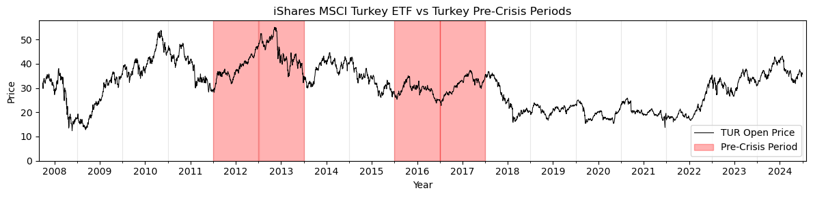

<div align="center">

  <h1>
    Challenges in and Recommendations for Predicting Financial Crises in Emerging Markets
  </h1>
  
  <p>
  Arushi SINHA<br>
  Imperial College London
  </p>
   
<h4>
    <a href="https://github.com/arushisinha98/emerging-crises/blob/main/report.pdf">Report</a>
  <span> · </span>
    <a href="https://github.com/arushisinha98/emerging-crises/tree/main/docs">Documentation</a>
  <span> · </span>
    <a href="https://github.com/arushisinha98/emerging-crises/tree/main/demos">Notebooks</a>
</h4>

</div>

<br />

<!-- Table of Contents -->
# Table of Contents

- [About the Project](#about-the-project)
- [Getting Started](#getting-started)
  * [Environment Variables](#environment-variables)
  * [Installation](#installation)
  * [Running Tests](#running-tests)
- [Usage](#usage)
- [License](#license)
- [Contact](#contact)
- [Acknowledgements](#acknowledgements)
  

<!-- About the Project -->
## About the Project

This is Independent Research Project (IRP) by Arushi Sinha, completed as a capstone module in the Ada Lovelace Academy at Imperial College London. All research and contributions were made between June to August 2025.

This IRP was completed in collaboration with
- Antony Sommerfeld, Adamant Investment Partners
- Ben Moseley, Imperial College London

We also acknowledge Marijan Beg who was instrumental in coordinating this research effort for the Ada Lovelace Academy.

<!-- Getting Started -->
## Getting Started

<!-- Env Variables -->
### Environment Variables

This project uses HuggingFace Hub to run the data pipeline. In your .env file, set the following environment variables. Refer to .env.example as a reference.

`HUGGINGFACE_USERNAME`
`HUGGINGFACE_TOKEN`

### Get Started

Start by cloning the repository. Install the dependencies and run the tests. The pytests created for this repository are designed to test the functionality of the data pipeline. To run these tests, run the following command on your terminal.


```bash
# install dependencies
pixi install
# temporarily add project root to python path
export PYTHONPATH=$PYTHONPATH:.
# run testss
pixi run pytest -v .
```

This will take a few minutes but it is important that these run to ensure that the data pipeline is functioning correctly for you to be able to reproduce the results in the report.

## Usage

Once the setup is complete and the tests have passed, run the main data pipeline to load the necessary datasets onto your HuggingFace Hub.

```bash
pixi run python -m main.py
```

Note that the following data files will need to be in your local `data` directory to run this pipeline.
1. JSTdatasetR6.xlsx
2. a-new-comprehensive-database-of-financial-crises.xlsx
3. 20160923_global_crisis_data.xlsx
4. iso-standard-master.csv

Once the pipeline has been successfully run, the following variable description files will be created in your local `data` directory.

1. worldbank_variables.csv
2. oecd_variables.csv
3. yahoofinance_variables.csv
4. jst_variables.csv

Now that your data is sorted, you can refer to the Jupyter Notebooks in `demos` to run the experiments described in the report. The Notebooks are best run sequentially as each experiment and analysis builds on the previous.

Here is a brief description of the content in each Notebook:

| Notebook | Description |
|----------|-------------|
| `0.Introduction.ipynb` | Sample plots to showcase crisis distributions and motivate the project. |
| `1.DataPreparation.ipynb` | Data loading, cleaning, and preprocessing pipeline. Handles missing values, outliers, and feature engineering for both developed and emerging markets datasets. |
| `2.BaselineClassifiers.ipynb` | Implementation and evaluation of tree-based machine learning classifiers as baseline models for crisis prediction. |
| `3.FeatureSelection.ipynb` | Exploration of different types of dimensionality reduction methods (e.g. PCA, t-SNE, UMAP, VAE) performed on the data.
| `4.MLVSDLClassifiers.ipynb` | Performance comparison of machine learning with linear and non-linear dimensionality reduction techniques. |
| `5.LSTMClassifier.ipynb` | End-to-end LSTM classifier with attention mechanisms, trained using precision-based focal loss. Includes transfer learning experiments for emerging markets. |
| `6.FeatureSpace.ipynb` | A visualization of the feature space of the trained LSTM Classifier. |

<!-- Contact -->
## Contact

Arushi SINHA - arushi.sinha24@imperial.ac.uk

<!-- Acknowledgments -->
## Acknowledgements

 - [Readme Template](https://github.com/Louis3797/awesome-readme-template)
