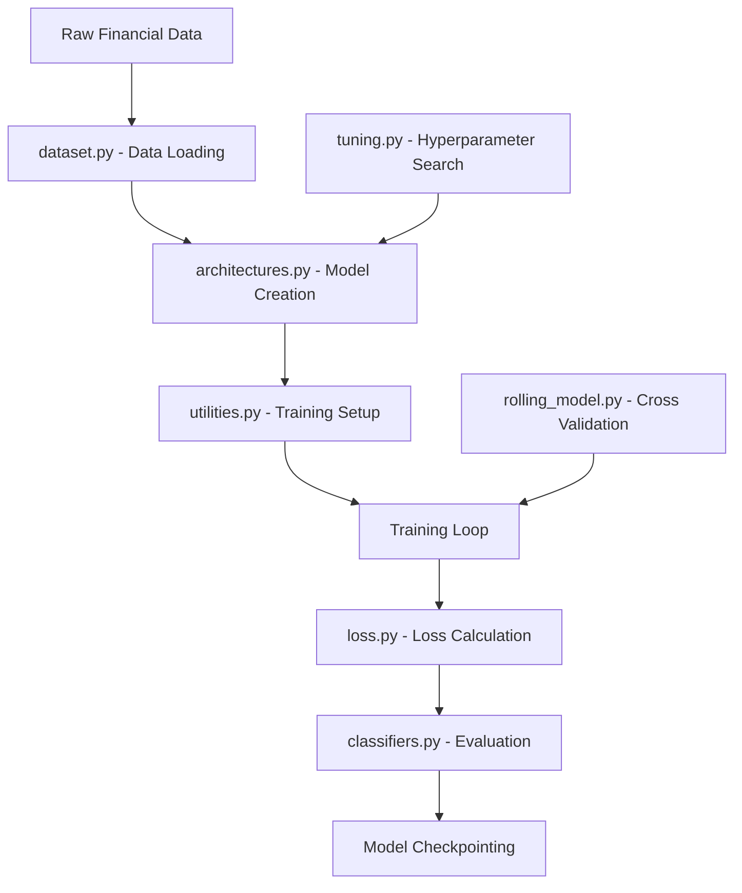

# Model Module Documentation

## Overview

This directory contains comprehensive documentation for all model-related modules in the Financial Crisis Predictor project. The model modules implement deep learning architectures, training utilities, evaluation frameworks, and hyperparameter optimization tools for financial time series prediction.

## Quick Start Guide

### Basic Model Training Pipeline

```python
# 1. Set up environment and data
from src.model.utilities import set_seed, set_device
from src.model.dataset import FinancialTimeSeriesDataset
from src.model.architectures import LSTMClassifier

# Setup
set_seed(42)
device = set_device("cuda")

# Load data
dataset = FinancialTimeSeriesDataset(data_path="data/processed/")
train_loader, val_loader = dataset.get_data_loaders(batch_size=32)

# 2. Initialize model
model = LSTMClassifier(
    input_size=dataset.feature_dim,
    hidden_size=128,
    num_layers=2,
    output_size=1,
    dropout=0.2
).to(device)

# 3. Train with utilities
from src.model.utilities import train_epoch, validate_epoch
import torch.nn as nn
import torch.optim as optim

criterion = nn.BCEWithLogitsLoss()
optimizer = optim.Adam(model.parameters(), lr=1e-3)

for epoch in range(100):
    train_loss = train_epoch(model, train_loader, criterion, optimizer, device)
    val_metrics = validate_epoch(model, val_loader, criterion, device)
    
    if epoch % 10 == 0:
        print(f"Epoch {epoch}: Train Loss: {train_loss:.4f}, Val F1: {val_metrics['f1']:.4f}")

# 4. Evaluate performance
from src.model.classifiers import comprehensive_model_evaluation
results = comprehensive_model_evaluation(model, val_loader, device)
```

### Advanced Hyperparameter Optimization

```python
# Use Bayesian optimization for model tuning
from src.model.tuning import BayesianOptimizer

def objective_function(learning_rate, hidden_size, num_layers, dropout, batch_size):
    # Create and train model with these parameters
    model = LSTMClassifier(
        input_size=feature_dim,
        hidden_size=int(hidden_size),
        num_layers=int(num_layers),
        dropout=dropout
    )
    
    # Train and evaluate
    score = train_and_evaluate(model, learning_rate, int(batch_size))
    return score

# Set up optimization
optimizer = BayesianOptimizer(
    f=objective_function,
    pbounds={
        'learning_rate': (1e-5, 1e-1),
        'hidden_size': (64, 512),
        'num_layers': (1, 4),
        'dropout': (0.0, 0.5),
        'batch_size': (16, 128)
    }
)

# Find optimal parameters
optimizer.maximize(init_points=5, n_iter=25)
best_params = optimizer.max['params']
```

## Module Index

| Module | Purpose | Key Features |
|--------|---------|--------------|
| [`architectures.py`](architectures.md) | Neural network architectures | FFNN, LSTM, CNN classifiers for financial data |
| [`classifiers.py`](classifiers.md) | Model evaluation utilities | Comprehensive metrics, ROC curves, confusion matrices |
| [`dataset.py`](dataset.md) | PyTorch dataset classes | Time series datasets, data loaders, preprocessing |
| [`loss.py`](loss.md) | Custom loss functions | Focal loss, weighted BCE, time series specific losses |
| [`rolling_model.py`](rolling_model.md) | Time series cross-validation | Walk-forward analysis, temporal data splits |
| [`tuning.py`](tuning.md) | Hyperparameter optimization | Bayesian optimization, automated parameter search |
| [`utilities.py`](utilities.md) | Training utilities | Reproducibility, device management, training loops |

## Architecture Overview

### Model Training Flow



### Key Design Principles

1. **Modularity**: Each component serves a specific purpose and can be used independently
2. **Flexibility**: Support for multiple architectures, loss functions, and evaluation metrics
3. **Reproducibility**: Comprehensive seed setting and deterministic operations
4. **Scalability**: GPU support, batch processing, and efficient memory usage
5. **Evaluation**: Thorough model evaluation with multiple metrics and visualizations

## Core Components

### Neural Network Architectures
- **Feed-Forward Networks**: Multi-layer perceptrons for tabular financial data
- **LSTM Networks**: Recurrent architectures for sequential financial time series
- **CNN Architectures**: Convolutional networks for pattern recognition in financial data
- **Hybrid Models**: Combinations of different architectural components

### Training Infrastructure
- **Reproducible Training**: Comprehensive seed setting for consistent results
- **Device Management**: Automatic GPU/CPU detection and optimization
- **Training Loops**: Robust training and validation procedures
- **Progress Monitoring**: Real-time metrics and visualization

### Evaluation Framework
- **Comprehensive Metrics**: Accuracy, precision, recall, F1-score, AUC-ROC
- **Visualization Tools**: ROC curves, confusion matrices, training histories
- **Statistical Analysis**: Confidence intervals, significance testing
- **Model Comparison**: Tools for comparing multiple model performances

### Data Handling
- **Time Series Datasets**: Specialized datasets for financial time series
- **Preprocessing Pipelines**: Data normalization, feature scaling, sequence creation
- **Data Loading**: Efficient batch loading with proper temporal ordering
- **Cross-Validation**: Time-aware data splits for robust evaluation

## Advanced Features

### Time Series Specific Functionality
- **Temporal Cross-Validation**: Walk-forward analysis respecting temporal order
- **Sequence Processing**: Proper handling of sequential financial data
- **Multi-horizon Forecasting**: Support for different prediction horizons
- **Regime Detection**: Tools for identifying different market conditions

### Hyperparameter Optimization
- **Bayesian Optimization**: Intelligent parameter search using Gaussian processes
- **Multi-objective Optimization**: Optimize for multiple metrics simultaneously
- **Early Stopping**: Prevent overfitting with intelligent stopping criteria
- **Parameter Scheduling**: Dynamic parameter adjustment during training

### Performance Optimization
- **GPU Acceleration**: Optimized CUDA operations for faster training
- **Mixed Precision**: Automatic mixed precision for memory efficiency
- **Batch Processing**: Efficient batch operations for large datasets
- **Memory Management**: Optimized memory usage for large models

## Getting Started

### Installation and Setup
1. Ensure all dependencies are installed (see individual module docs)
2. Set up your Python environment with GPU support if available
3. Prepare your financial data in the expected format

### Basic Usage Pattern
1. **Data Preparation**: Use `dataset.py` to create PyTorch datasets
2. **Model Selection**: Choose appropriate architecture from `architectures.py`
3. **Training Setup**: Configure training with `utilities.py`
4. **Model Training**: Execute training loops with monitoring
5. **Evaluation**: Assess performance with `classifiers.py`
6. **Optimization**: Fine-tune with `tuning.py` if needed

### Advanced Workflows
1. **Hyperparameter Search**: Use Bayesian optimization for parameter tuning
2. **Cross-Validation**: Implement robust temporal cross-validation
3. **Model Comparison**: Compare multiple architectures systematically
4. **Production Deployment**: Export trained models for inference

## Best Practices

### Model Development
- Start with simple architectures and gradually increase complexity
- Use proper temporal cross-validation for time series data
- Monitor both training and validation metrics
- Save model checkpoints regularly

### Training Procedures
- Set random seeds for reproducibility
- Use appropriate learning rate scheduling
- Implement early stopping to prevent overfitting
- Monitor GPU memory usage for large models

### Evaluation Standards
- Use multiple evaluation metrics appropriate for financial applications
- Create comprehensive evaluation reports with visualizations
- Perform statistical significance testing when comparing models
- Document all experimental parameters and results

### Performance Optimization
- Profile training procedures to identify bottlenecks
- Use efficient data loading with multiple workers
- Consider mixed precision training for large models
- Optimize batch sizes for available hardware

## Integration Examples

### Complete Training Pipeline

```python
from src.model import *
import torch
import torch.nn as nn
import torch.optim as optim
from sklearn.model_selection import train_test_split

# Data preparation
dataset = FinancialTimeSeriesDataset("data/processed/")
train_loader, val_loader, test_loader = dataset.get_data_loaders(
    batch_size=32, 
    train_ratio=0.7, 
    val_ratio=0.2
)

# Model setup
device = set_device("cuda")
model = LSTMClassifier(
    input_size=dataset.feature_dim,
    hidden_size=128,
    num_layers=2,
    dropout=0.2
).to(device)

# Training configuration
criterion = FocalLoss(alpha=0.25, gamma=2.0)  # Handle class imbalance
optimizer = optim.Adam(model.parameters(), lr=1e-3)
scheduler = optim.lr_scheduler.ReduceLROnPlateau(optimizer, patience=10)

# Training loop
train_losses = []
val_metrics_history = {metric: [] for metric in ['accuracy', 'f1', 'auc']}

for epoch in range(100):
    # Training
    train_loss = train_epoch(model, train_loader, criterion, optimizer, device)
    
    # Validation
    val_metrics = validate_epoch(model, val_loader, criterion, device)
    
    # Learning rate scheduling
    scheduler.step(val_metrics['loss'])
    
    # Store metrics
    train_losses.append(train_loss)
    for metric in val_metrics_history:
        val_metrics_history[metric].append(val_metrics[metric])
    
    # Progress reporting
    if epoch % 10 == 0:
        print(f"Epoch {epoch}: Train Loss: {train_loss:.4f}, "
              f"Val F1: {val_metrics['f1']:.4f}, "
              f"Val AUC: {val_metrics['auc']:.4f}")

# Final evaluation
test_results = comprehensive_model_evaluation(model, test_loader, device)
plot_training_history(train_losses, val_metrics_history)
```

### Cross-Validation with Hyperparameter Optimization

```python
from src.model.rolling_model import TimeSeriesCrossValidation
from src.model.tuning import BayesianOptimizer

# Set up time series cross-validation
cv = TimeSeriesCrossValidation(
    n_splits=5,
    test_size=0.2,
    gap=0,  # No gap between train/test
    time_column='date'
)

# Define hyperparameter optimization objective
def cv_objective(learning_rate, hidden_size, num_layers, dropout):
    scores = []
    
    for train_idx, val_idx in cv.split(dataset):
        train_subset = Subset(dataset, train_idx)
        val_subset = Subset(dataset, val_idx)
        
        # Create data loaders
        train_loader = DataLoader(train_subset, batch_size=32, shuffle=True)
        val_loader = DataLoader(val_subset, batch_size=32, shuffle=False)
        
        # Create and train model
        model = LSTMClassifier(
            input_size=dataset.feature_dim,
            hidden_size=int(hidden_size),
            num_layers=int(num_layers),
            dropout=dropout
        ).to(device)
        
        optimizer = optim.Adam(model.parameters(), lr=learning_rate)
        criterion = nn.BCEWithLogitsLoss()
        
        # Training loop
        for epoch in range(50):
            train_epoch(model, train_loader, criterion, optimizer, device)
        
        # Evaluate
        val_metrics = validate_epoch(model, val_loader, criterion, device)
        scores.append(val_metrics['f1'])
    
    return np.mean(scores)

# Optimize hyperparameters
optimizer = BayesianOptimizer(
    f=cv_objective,
    pbounds={
        'learning_rate': (1e-5, 1e-1),
        'hidden_size': (64, 256),
        'num_layers': (1, 4),
        'dropout': (0.0, 0.5)
    }
)

optimizer.maximize(init_points=5, n_iter=20)
best_params = optimizer.max['params']
print(f"Best parameters: {best_params}")
```

## Troubleshooting

### Common Issues
- **Memory Errors**: Reduce batch size or model complexity
- **Slow Training**: Check data loading efficiency and GPU utilization
- **Poor Performance**: Verify data preprocessing and feature engineering
- **Overfitting**: Increase regularization or reduce model complexity

### Debug Tools
- Use validation curves to diagnose overfitting/underfitting
- Monitor gradient norms to detect vanishing/exploding gradients
- Visualize learned features and attention weights
- Profile code to identify performance bottlenecks

## Contributing

When adding new model components:
1. Follow the established module structure and naming conventions
2. Include comprehensive docstrings and type hints
3. Add corresponding documentation in this directory
4. Include usage examples and integration tests
5. Update this README with new module information

## Dependencies

Core dependencies across all model modules:
- **PyTorch**: Deep learning framework
- **NumPy**: Numerical computations
- **Scikit-learn**: Machine learning utilities
- **Matplotlib**: Visualization
- **Pandas**: Data manipulation
- **Bayesian Optimization**: Hyperparameter tuning
- **TQDM**: Progress bars

For specific module dependencies, see individual documentation files.
